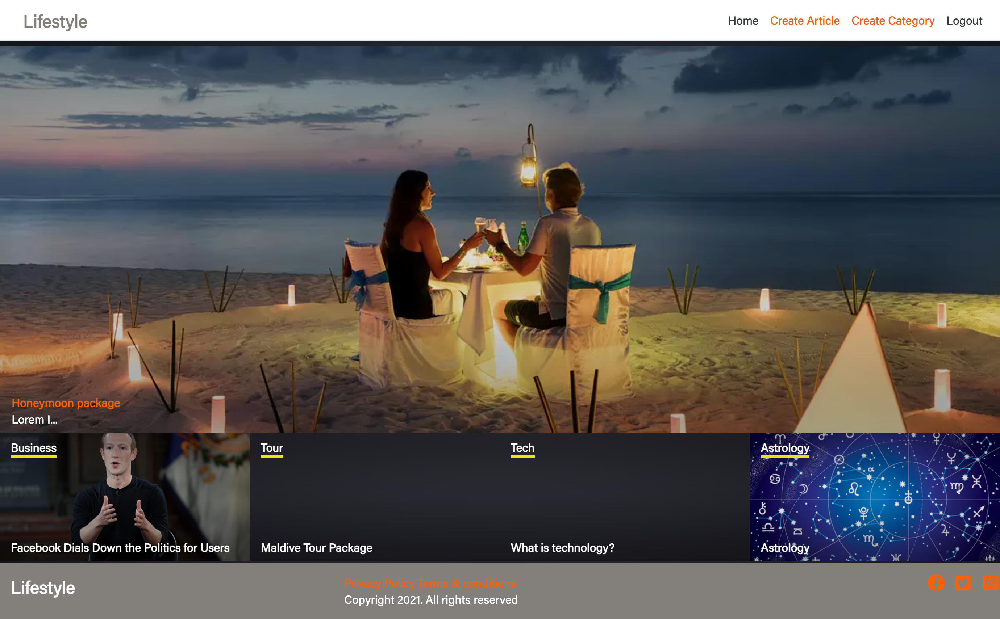

# lifestyle-app
I build a website based on lifestyle articles.
- To use the app, you have to sign in or log in
- Authenticated user:
  - can create articles categories
  - can create articles and link those articles to many categories
  - can comment on article
  - can vote an article
- The homepage shows a featured article (who has the biggest number of votes), and the list of all the categories in order of priority
- The category page show all the articles for a category
- The article page shows the content of an article.

## Project screenshot

## 🔨 Built in

- Ruby on Rails 6.0.3
- Bootstrap 4

## 🚀 Our Project

Our project can be found at https://github.com/sumon0002001/rorcapstone_lifestyle

## Live Demo

You can find the demo [here](https://agile-falls-81971.herokuapp.com/)

## Video Link

You can find the presentation [here](https://www.loom.com/share/bbea73c1085e4edfa17b1e5f8c9542cb)

## To run the project in local

- clone the repository from here [repo link](https://github.com/sumon0002001/rorcapstone_lifestyle)
- Open terminal and navigate to root folder (rorcapstone_lifestyle).
- Once in root folder
  - type: `rails s` in terminal and in browser
  - run `bundle install`
  - run `yarn install`
  - run`rails db:create`
  - run `rails db:migrate`
  - type localhost:3000/ in address bar.

## How to run the test suite

We added validations and associations tests for User, Event and Attendance models.
We added also integration tests for authentication and event creation
Run these tests with those commands:

### unit tests
- `rspec spec/user_spec.rb`
- `rspec spec/category_spec.rb`
- `rspec spec/article_spec.rb`
- `rspec spec/vote_spec.rb`
- `rspec spec/organization_spec.rb`

### integration tests
- `rspec spec/features/authenticate_user_spec.rb`
- `rspec spec/features/create_category_spec.rb`

👤 **Mir Rawshan Ali**

- GitHub: [@sumon0002009](https://github.com/sumon0002001)
- Twitter: [@sumon0002009](https://twitter.com/Sumon0002009)
- LinkedIn: [Mir Rawshan Ali](https://www.linkedin.com/in/mir-rawshan-ali-27b6a5198/)

## Acknowledgement

I have followed the 
[design](https://www.behance.net/gallery/14554909/liFEsTlye-Mobile-version) given by [Nelson Sakwa](https://www.behance.net/sakwadesignstudio) in Behance

## 🤝 Contributing

Contributions, issues and feature requests are welcome!

## Show your support

Give a ⭐️ if you like this project!

## 📝 License

This project is no licensed.
